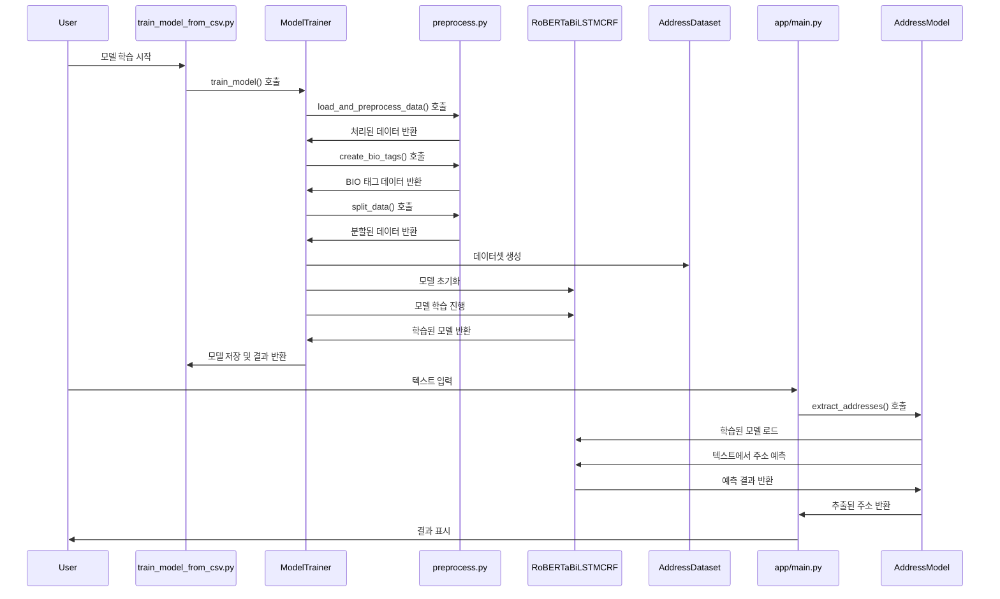
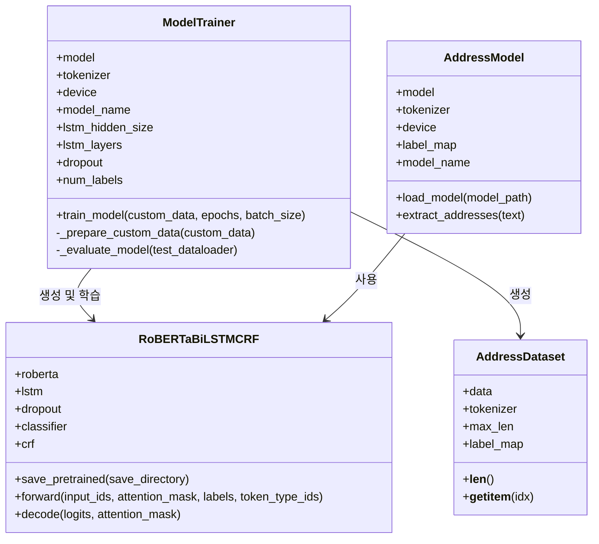

# 한국어 주소 추출 NER 프로젝트 구조

## 프로젝트 디렉토리 구조

```mermaid
graph TD
    classDef root fill:#f96,stroke:#333,stroke-width:2px
    classDef dir fill:#b8d4ff,stroke:#333,stroke-width:1px
    classDef file fill:#FFFFFF,stroke:#333,stroke-width:1px
    classDef mainFile fill:#CFFFE5,stroke:#333,stroke-width:1px
    classDef model fill:#FFD966,stroke:#333,stroke-width:1px
    classDef service fill:#C9DAF8,stroke:#333,stroke-width:1px
    classDef utils fill:#D9D2E9,stroke:#333,stroke-width:1px
    classDef data fill:#F4CCCC,stroke:#333,stroke-width:1px

    A[extract-address-ner] :::root
    
    %% 최상위 디렉토리와 파일
    A --> B[app/] :::dir
    A --> C[data/] :::dir
    A --> D[train_model_from_csv.py] :::mainFile
    A --> E[run.py] :::mainFile
    A --> F[requirements.txt] :::file
    A --> G[README.md] :::file
    A --> H[Mermaid.md] :::file

    %% app 디렉토리
    B --> I[services/] :::dir
    B --> J[utils/] :::dir
    B --> K[models/] :::dir
    B --> L[main.py] :::mainFile
    B --> M[__init__.py] :::file

    %% app/services 디렉토리
    I --> N[ml_model.py] :::service
    I --> O[train_service.py] :::service
    I --> P[db_service.py] :::service
    I --> Q[__init__.py] :::file

    %% app/utils 디렉토리
    J --> R[preprocess.py] :::utils
    J --> S[__init__.py] :::file

    %% app/models 디렉토리
    K --> T[address.py] :::model
    K --> U[__init__.py] :::file

    %% data 디렉토리
    C --> V[korean_address_dataset.csv] :::data
```

## 코드 구조 및 데이터 흐름

```mermaid
flowchart TD
    classDef moduleNode fill:#BBFFBB,stroke:#333,stroke-width:1px
    classDef serviceNode fill:#C9DAF8,stroke:#333,stroke-width:1px
    classDef dataNode fill:#F4CCCC,stroke:#333,stroke-width:1px
    classDef modelNode fill:#FFD966,stroke:#333,stroke-width:1px
    classDef utilsNode fill:#D9D2E9,stroke:#333,stroke-width:1px
    
    %% 주요 모듈
    A[train_model_from_csv.py] :::moduleNode
    B[app/main.py] :::moduleNode
    C[run.py] :::moduleNode
    
    %% 서비스
    D[ModelTrainer]:::serviceNode
    E[RoBERTaBiLSTMCRF]:::modelNode
    F[AddressDataset]:::modelNode
    G[AddressModel]:::serviceNode
    
    %% 유틸리티
    H[load_and_preprocess_data]:::utilsNode
    I[create_bio_tags]:::utilsNode
    J[split_data]:::utilsNode
    
    %% 데이터
    K[korean_address_dataset.csv]:::dataNode
    
    %% 관계
    A -->|호출| D
    D -->|사용| E
    D -->|사용| F
    D -->|호출| H
    D -->|호출| I
    D -->|호출| J
    
    B -->|호출| G
    G -->|사용| E
    
    C -->|실행| B
    
    H -->|읽기| K
```

## 모델 학습 및 추론 과정



## 주요 클래스 다이어그램

